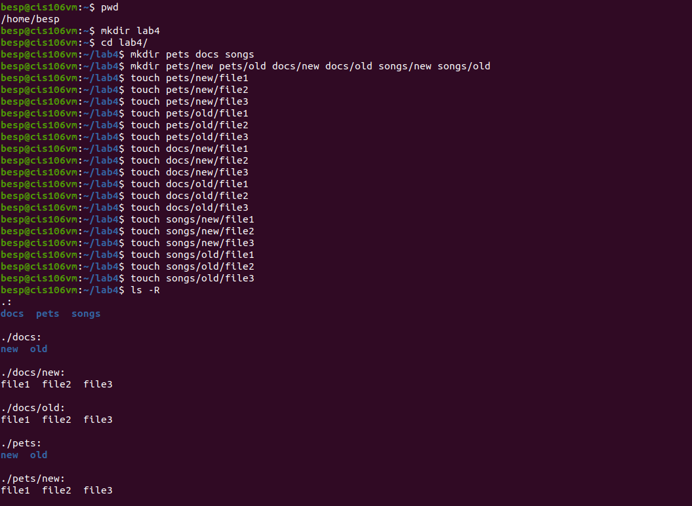
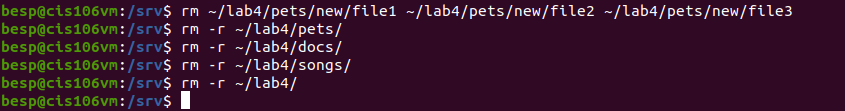
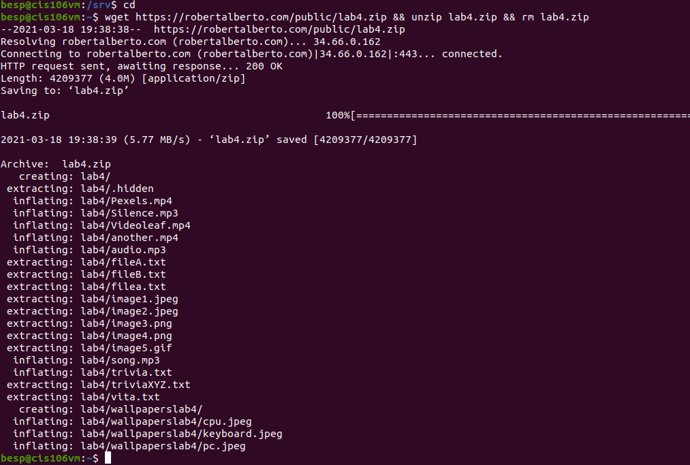
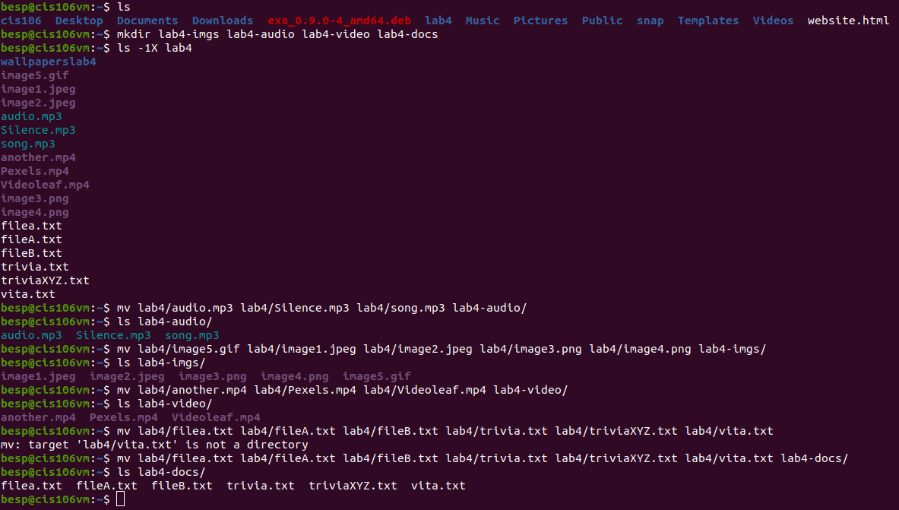
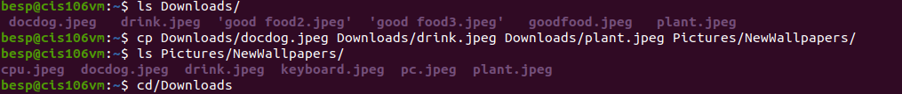
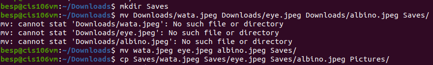

# Lab 4 | Managing files and directories | Answers
Assignment description [here](https://raw.githubusercontent.com/ra559/cis106/main/labs/lab4.1.md)

## Question 1

## Question 2

## Question 3

## Question 4

